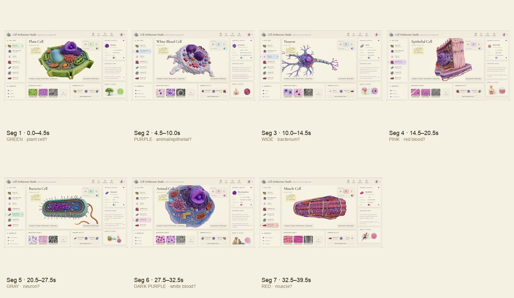

# 01 · Video Breakdown: `pW1N8Cz6sTwINRnK.mp4`

> 🌐 **English** · [简体中文](./01-video-analysis.md) · [日本語](./01-video-analysis.ja.md)

## File metadata

| Field | Value |
|---|---|
| Path | `data/pW1N8Cz6sTwINRnK.mp4` |
| Duration | **41.8333 s** |
| Frame rate | 60 fps |
| Total frames | 2370 (encoded) / 1961 (actually displayed) |
| Resolution | 3024 × 1714 |
| Codec | H.264 High @ Level 5.2 |
| Bitrate | 4.21 Mbps |
| Muxer | `Twitter-vork muxer` |
| File size | 20.5 MB |
| Inferred origin | Tripo3D server-side auto-generated product demo tour |

## Core conclusion

> **The video is not a single orbit around a plant cell — it's a screen recording of the product's "automatic Cinema-mode tour", cycling through 7 cells, each 4.5–7.0 seconds, with hard cuts between, and zero UI elements.**

## Shot table (algorithmically detected)

Detection method: sample 1 frame every 0.5 s (79 frames total). For each frame, compute the **silhouette area, centroid, bounding box, and dominant RGB color**. Any sudden change (area shift > 5 %, centroid drift > 5 %, dominant-color Euclidean distance > 30) is flagged as a cut.

| # | Range | Length | Dominant RGB | Silhouette % | Centroid (cx, cy) | Inferred content |
|---|---|---|---|---|---|---|
| 1 | 0.0 – 4.5 s | **4.5 s** | (128, 128, 108) yellow-green | 23 % | (0.48, 0.49) centered | **Plant cell** (chloroplast green) |
| 2 | 4.5 – 10.0 s | **5.5 s** | (154, 132, 154) purple-pink | 17 % | (0.48, 0.46) slightly upper | **Animal / epithelial cell** (large purple nucleus) |
| 3 | 10.0 – 14.5 s | **4.5 s** | (154, 140, 154) grey-purple | **10 %** ⚠ | (0.44, 0.52) slightly lower | **Bacteria** (small object / pulled-back framing) |
| 4 | 14.5 – 20.5 s | **6.0 s** | (162, 120, 132) pink-red | 19 % | (0.47, 0.47) | **Red blood cell / muscle** (red-pink) |
| 5 | 20.5 – 27.5 s | **7.0 s** | (132, 127, 134) mid grey | 16 % | (0.45, 0.47) | **Neuron / white blood cell** (grey) |
| 6 | 27.5 – 32.5 s | **5.0 s** | (133, 112, 139) dark purple | 22 % | (0.47, 0.48) | **White blood cell / macrophage** (large purple) |
| 7 | 32.5 – 39.5 s | **7.0 s** | (159, 108, 122) red-orange | 18 % | (0.48, 0.50) | **Muscle / red blood** (red-orange) |

Representative-frame grid:

## Intra-segment dynamics

| Dimension | Observation | Interpretation |
|---|---|---|
| Centroid stability | cx/cy jitter < 0.05 within each segment | **Almost no panning per segment** — it's a "standing" presentation |
| Silhouette stability | area jitter < 3 % within each segment | **No zoom in/out** — camera distance is fixed |
| Color stability | RGB Euclidean distance < 10 within each segment | **Very slow self-rotation** (color doesn't shift much) |
| Cut sharpness | Done within 1 frame | **Hard cuts**, not fades |

→ Each segment is **"fixed camera + slow, small-amplitude self-rotation"**, not a flight orbit. This is entirely different from the Hunyuan-style three-shot + wide orbit videos.

## Palette (K-means × 12)

Extracted from 6 full-resolution frames uniformly sampled across the video:

| Color | Share | Inferred use |
|---|---|---|
| `#f4f1e2` `#f6f3e4` `#f0ebdd` `#f7f1e3` `#f4efe1` `#f4f0e5` | **53 %** | **Cream-paper background** (HDRI primary) |
| `#ebe7d9` `#e2ddd0` | 20 % | Mid-tone of the background gradient |
| `#c6beb8` | 5 % | Deep end of the background gradient |
| `#a19698` | 6 % | Neutral grey / shadow |
| `#8a7a5e` | **6 %** | **Warm amber** (primary organelle color) |
| `#4b474b` | 4 % | Dark shadow |

**Overall feel**: warm-white base + warm-grey shadow + warm-amber accent — **magazine / textbook / specimen-card** material.
**No cool purples, no deep blacks** — my earlier "moody dark" reading was wrong.

## Evidence of no UI

By brightness statistics + gradient detection on the outer-edge 5 % regions:

| Region | Edge brightness (mean) | Center brightness (mean) | Strong gradient spikes |
|---|---|---|---|
| Top 5 % | 226 | 188 | Only 1 (H=1, the very first row) |
| Bottom 5 % | 230 | 188 | Only 1 (H=H-1) |
| Left 5 % | 224 | 172 | 0 |
| Right 5 % | 232 | 172 | 0 |

→ Bright edges are the **HDRI gradient itself** (background is lit at the edges, darker in the center where the model occludes), not UI panels. **The video really has no UI.**

## Implications (product layer)

1. This video is the product's **"demo / marketing / screen recording"** material, not a user-interaction recording.
2. The actual product interaction UI lives elsewhere (the reference image `Cell Architecture Studio`).
3. But the video **encodes a product feature script** that we can read off:
   - Multi-cell library (7+)
   - Auto Tour
   - Per-cell independent camera preset + dwell duration
   - Cinema mode (UI-free fullscreen)
   - Top-tier PBR + HDRI rendering
4. These map to feature numbers **F01 – F08** in the feature list (see [03-features.md](./03-features.md)).
