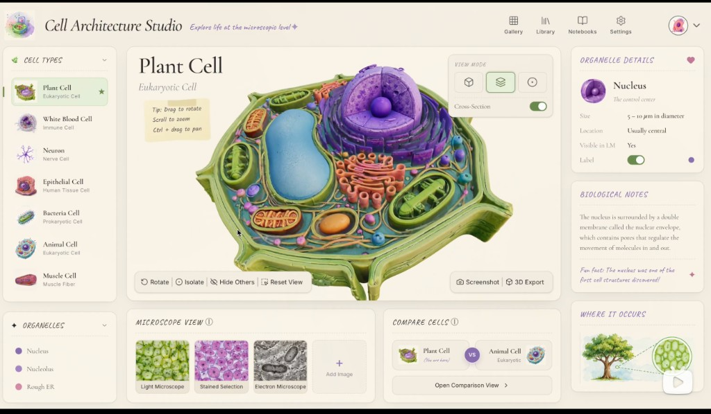
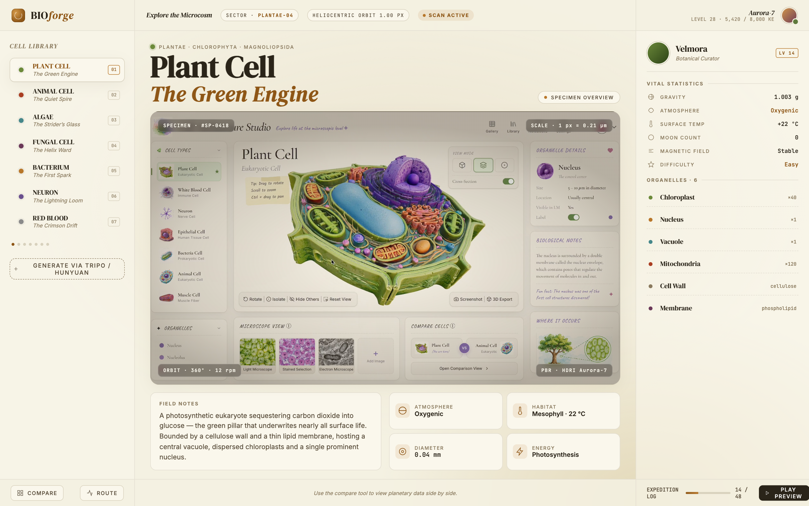

# 02 · Design Gap Analysis: Reference vs My v1

> 🌐 **English** · [简体中文](./02-design-gap.md) · [日本語](./02-design-gap.ja.md)

## Reference (user-supplied)



**Product name**: Cell Architecture Studio
**Tagline**: Explore life at the microscopic level ✦
**Overall feel**: Notebook-style learning workshop — warm, textbook-like, with decorative motifs (✦ ❤ Post-it stickers)

## My v1 static mockup (rejected)



**Product name**: BIOforge
**Tagline**: EXPLORE THE MICROCOSM
**Overall feel**: Deep-space commander accidentally drops into botany — **RPG / sci-fi elements severely overloaded** (misuse of the AERIS skeleton)

## Palette comparison

| Axis | Reference | My v1 |
|---|---|---|
| Background base | `#f2ece0` `#f8f3e7` `#faf4e8` cream | `#f4f1e2` `#f0ebdd` cream ✅ same family |
| Primary accent | **`#9a945b` olive** (biological context) | **`#b8772a` warm amber** (rusty feel) ❌ wrong context |
| Secondary accent | **`#554f7c` soft lilac** (nucleus / organelles) | none ❌ |
| Dark text | `#0b0b08` near-black | `#2a2419` warm black ✅ close enough |

## Top bar comparison

| Element | Reference | My v1 | Diff |
|---|---|---|---|
| Logo | Cute multicolor cell motif (pink / green) | Abstract orange gear | ❌ |
| Brand font | Handwritten serif (Caveat / Kalam-like) | Standard serif DM Serif | ❌ |
| Brand name | Cell Architecture Studio | BIOforge | ❌ |
| Tagline | "Explore life at the microscopic level ✦" — soft | "EXPLORE THE MICROCOSM" — all caps military | ❌ |
| **Nav tabs** | **Gallery / Library / Notebooks / Settings** (icon + text) | None at all | 🔴 **entire block missing** |
| User region | Avatar + chevron (minimal) | Avatar + "Lv 28 · 5,420 / 8,000 KE" (RPG stats) | ❌ |
| Scan animation | None | "SCAN ACTIVE" orange pulse | ❌ |
| Center nameplate | None | "SECTOR · PLANTAE-04" / "HELIOCENTRIC ORBIT 1.00 PX" | ❌ |

## Left sidebar comparison

| Element | Reference | My v1 | Diff |
|---|---|---|---|
| Section title | **CELL TYPES** (handwriting + collapse chevron) | Cell Library (standard caps) | 🟡 |
| Cell thumbnail | **Real color circular portrait per item** (photo / AI render) | Just colored dots | 🔴 |
| Cell entries | `Plant Cell` + subtype `Eukaryotic Cell` | `PLANT CELL` + epithet `The Green Engine` | 🔴 epithet is AERIS residue |
| Favorite mark | ⭐ next to Plant Cell | None | ❌ |
| **Second section** | **ORGANELLES** (independent, collapsible: Nucleus / Nucleolus / Rough ER …) | Doesn't exist | 🔴 **entire block missing** |
| Pagination | None | 7 dots ●●●●●●● | ❌ |
| Plus button | None | "Generate via Tripo / Hunyuan" dashed box | 🟡 valid feature but wrong location |

## Central area comparison

| Element | Reference | My v1 | Diff |
|---|---|---|---|
| Title | `Plant Cell` + italic `Eukaryotic Cell`, two lines | `Plant Cell` + italic `The Green Engine` + breadcrumb (extra row) | 🟡 breadcrumb is extra |
| **Yellow Post-it hint** | **Present**: Drag to rotate / Scroll to zoom / Ctrl+drag to pan (hand-drawn curled corner) | None | 🔴 onboarding missing |
| Top-right of view | **View Mode** (3 icons + Cross-Section toggle) | Just a "Specimen Overview" badge | 🔴 **core interaction missing** |
| Canvas HUD | None | 4-corner HUD (SPECIMEN ID / SCALE / ORBIT / PBR) | ❌ unnecessary sci-fi ceremony |
| **Toolbar below canvas** | **Rotate / Isolate / Hide Others / Reset View / Screenshot / 3D Export** | None at all | 🔴 **core interaction missing** |
| Bottom 2 cards | **MICROSCOPE VIEW** (4 thumbs: LM / stained / EM / +) + **COMPARE CELLS** (two cells + Open Comparison) | Long description + 4 data chips | 🔴 completely mis-fit |

## Right sidebar comparison

| Element | Reference | My v1 | Diff |
|---|---|---|---|
| **First block** | **ORGANELLE DETAILS**: currently selected organelle (Nucleus) + Size / Location / Visible in LM / Label toggle | "Researcher Velmora · Botanical Curator · LV 14" + Gravity 1.003g / Atmosphere Oxygenic / Surface Temp +22°C / Moon Count 0 / Magnetic Field Stable / Difficulty Easy | 🔴 **wrong concept entirely** (RPG data) |
| **Second block** | **BIOLOGICAL NOTES**: textbook paragraph + "Fun fact" | List of organelles (chloroplast ×40 / nucleus ×1 / vacuole ×1 …) | 🔴 misplaced + missing |
| **Third block** | **WHERE IT OCCURS**: context picture (leaf + green cell circle) + playable video | None | 🔴 entirely missing |

## Bottom bar comparison

| Element | Reference | My v1 | Diff |
|---|---|---|---|
| Existence | **Doesn't exist** | Present: Compare / Route buttons + Expedition Log 14/48 + Play preview | 🔴 superfluous |

## Fatal issue (one line)

> I hard-mapped the AERIS (planetary-exploration) sci-fi skeleton onto a biological context, and the result is: **wrong tone, wrong vocabulary, missing core interactions (View Mode / toolbar / Microscope View / Compare Cells / Where it Occurs)**.

## v2 fix list (11 items)

1. ❌ **Remove** all RPG / sci-fi vocabulary: SCAN ACTIVE / SECTOR / HELIOCENTRIC / Expedition Log / Velmora / Gravity / Atmosphere / Moon Count / Surface Temp / Magnetic Field
2. ✏ **Rename** BIOforge → **Cell Architecture Studio** (handwritten serif logo)
3. ➕ **Add** 4 top-bar tabs: Gallery / Library / Notebooks / Settings
4. ➕ **Add** circular thumbnail per cell in the left bar
5. ➕ **Add** left-bar second section ORGANELLES (collapsible)
6. ➕ **Add** top-right View Mode (3 icons + Cross-Section toggle)
7. ➕ **Add** 6-button toolbar below the canvas
8. ➕ **Add** yellow Post-it operation hint (hand-drawn curled corner)
9. ➕ **Add** bottom two-card pair MICROSCOPE VIEW + COMPARE CELLS
10. 🔄 **Redo** right bar: ORGANELLE DETAILS + BIOLOGICAL NOTES + WHERE IT OCCURS
11. ❌ **Remove** bottom status bar (doesn't exist in the reference)

## Palette upgrade

```css
--bg:        #f2ece0;  /* was #f4f1e2 */
--paper:     #faf4e8;
--olive:     #9a945b;  /* primary accent — replaces former amber */
--olive-dk:  #5d5d36;
--lilac:     #908ab8;  /* secondary accent (organelles / nucleus) */
--lilac-dk:  #554f7c;
--text:      #0b0b08;
--text-soft: #5d5d36;
--text-mute: #9a945b;
--line:      #c9c1bf;
```
